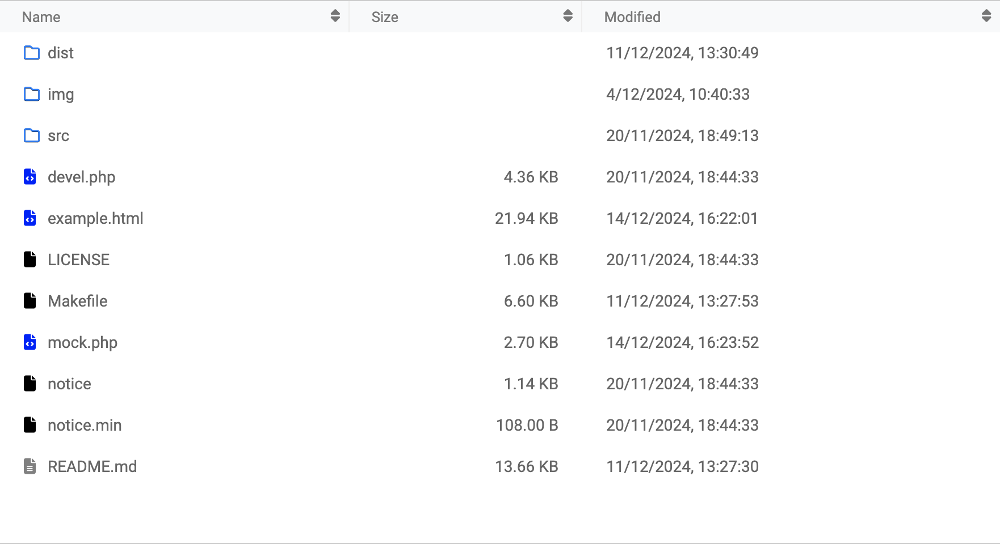
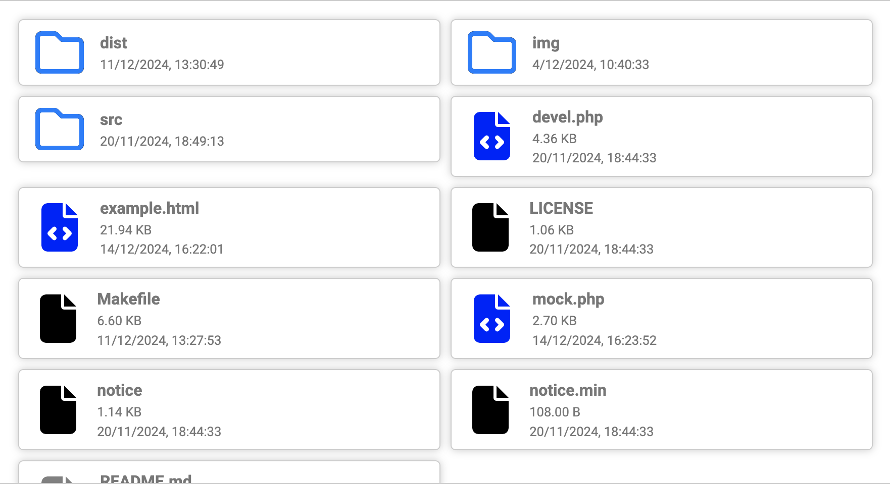
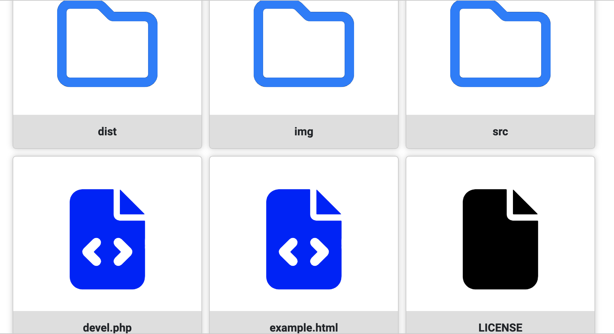
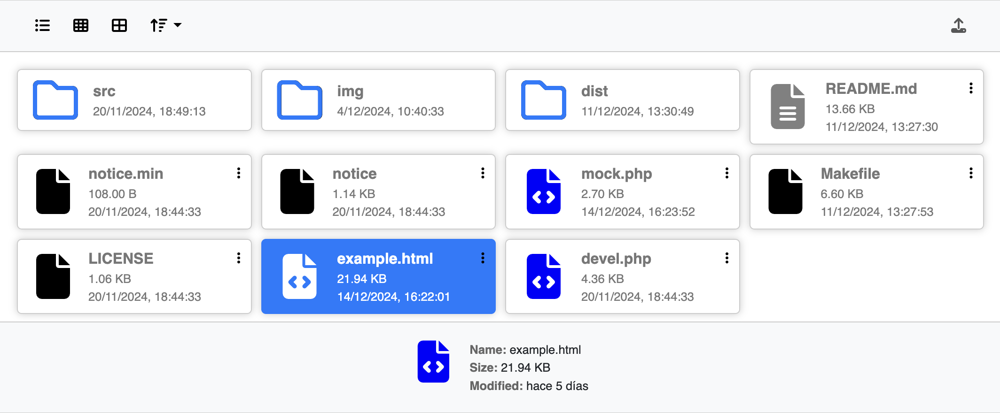
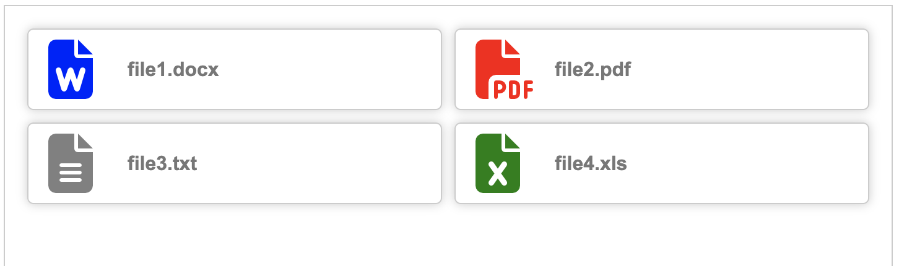
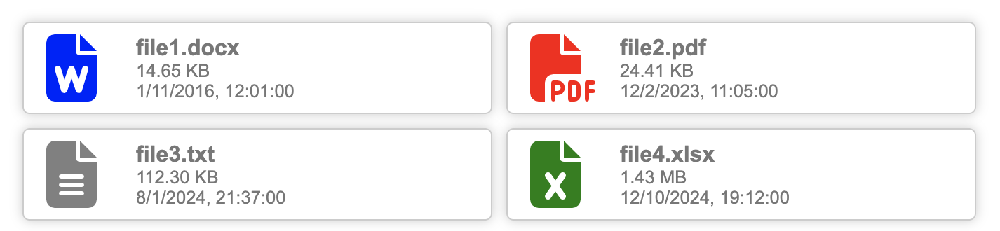
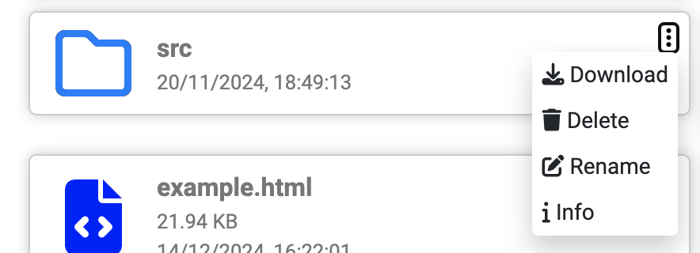
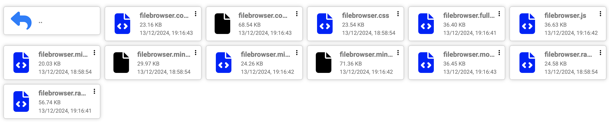
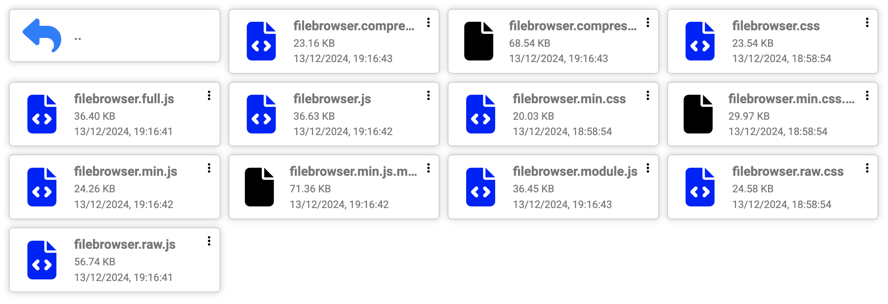

# FileBrowser

[](https://www.jsdelivr.com/package/gh/dealfonso/jsfb)    

`FileBrowser` is a JavaScript library that creates a file browser in the client side. It is intended to be used in web applications that need to access the files of a folder in the server.

It tries to show a similar interface to the one of the file browser of the operating system of the user, so the user can feel comfortable using it.

||
|--|
||
|--|
|
|--|

Using `FileBrowser` it is possible to create full featured file browsers that can be used to show the files of a folder, select files, download files, etc. like in the next image:



This example is included in the source, as `example.html`, but can be also seen at [Codepen - jsfb-full-example](https://codepen.io/dealfonso/pen/ByBWEam).

> **NOTICE**: This is no more than a __front end library__. It does not provide any functionality to access the files in the server. It is intended to be used in conjunction with a back end that provides the files to the library.

## Features

- **Grid, preview and list view**: The user can switch between each view. The grid view shows the files as icons, the list view shows the files as a list and the preview view shows the files as icons with a preview of the content (if provided).
- **Sorting**: The user can sort the files by name, size, date or type.
- **Selection**: The user can select one or more files.
- **Context menu**: The library enables the user to create context menus for the files (by providing a set of callbacks) or a custom context menu with custom actions and callbacks.

## Usage

1. Include the library in your html and the css file:

    ```html
    <script src="dist/filebrowser.js"></script>
    <link rel="stylesheet" href="dist/filebrowser.css">
    ```

    or from a CDN:

    ```html
    <script src="https://cdn.jsdelivr.net/gh/dealfonso/jsfb/dist/filebrowser.min.js"></script>
    <link rel="stylesheet" href="https://cdn.jsdelivr.net/gh/dealfonso/jsfb/dist/filebrowser.min.css">
    ```

2. Create a container for the file browser:

    ```html
    <div class="fb-filebrowser"></div>
    ```

3. Create a new instance of the file browser and add files to it:

    ```javascript
    let fb = new FileBrowser('.fb-filebrowser');
    fb.addFile({
        name: 'file1.txt',
        size: 1024,
        date: new Date()
    });
    ```

## Dependencies

The library has a dependency on the [Font Awesome](https://fontawesome.com/) library. The icons used in the file browser are based on the classes of this library. You should include the library in your project before the `css` file if you want to use the default icons.

In particular, the library uses font awesome in the `ico` property of the files, which is generated by the `extensionToIcon` dictionary of the options of `FileBrowser` instances. The default dictionary is defined in the `FileBrowser.extensionToIcon` static property, with values such as `fas fa-file-alt` for text files, `fas fa-file-pdf` for pdf files, `fas fa-file-word` for word files, etc.:

```javascript
static extensionToIcon = {
    'txt': 'fas fa-file-alt',
    'pdf': 'fas fa-file-pdf',
    'doc': 'fas fa-file-word',
    'docx': 'fas fa-file-word',
    'xls': 'fas fa-file-excel',
    ...
```

If you want to use your own icons, you can provide a custom dictionary in the `options` object of the `FileBrowser` instance.

> Font awesome is also used to show the __icon of the folders__. If you want to use your own icon for the folders, you can provide a custom icon when creating the folder (e.g. `addFolder("myfolder", { icon: 'fas fa-folder' })`).

## Using the `filebrowser` in a web application

The `filebrowser` is a class that can be used to create a file browser in a web application. It is intended to be used in conjunction with a back end that provides the files and enables to interact with them.

### Declarative usage

If is possible to create a simple file browser with files in it by using the declarative way:

```html
<div class="fb-filebrowser" data-fb-mode="grid">
    <fb-file>file1.docx</fb-file>
    <fb-file>file2.pdf</fb-file>
    <fb-file>file3.txt</fb-file>
    <fb-file>file4.xls</fb-file>
</div>
```

This example will produce a content like this:



This example can be seen in [Codepen - jsfb-basic-example](https://codepen.io/dealfonso/pen/gbYgqzO).

#### The `fb-filebrowser` element

The `fb-filebrowser` element is the container of the file browser. It can have the following attributes:

- `data-fb-mode`: The mode of the file browser ("list", "grid" or "preview").
- `data-fb-order-column`: The column to order the files by ("filename", "size", "date" or "type").
- `data-fb-order-ascending`: The order of the files (true = ascending, false = descending).
- `data-fb-hide-zero-size`: Whether to hide the size from zero size files (only the size will be hidden, the file will still be shown). The default value is `true`.
- `data-fb-allow-duplicates`: Whether to allow duplicate files (files with the same name). The default value is `false`. In case that a file with the same name is added, an exception will be thrown.
- `data-fb-separate-folders-from-files`: Whether to separate the folders from the files. If `true`, the files will always be shown before any other file. The default value is `true`.
- `data-fb-on-file-click`: A function to be called when a file is clicked.
- `data-fb-on-file-double-click`: A function to be called when a file is double clicked. 
- `data-fb-on-file-html-element-created`: A function to be called when the html element that represents the file is created.

And a set of callbacks that will be used to create a context menu for the files:

- `data-fb-on-file-download`: A function to be called when the option "Download" is selected in the default context menu.
- `data-fb-on-file-delete`: A function to be called when the option "Delete" is selected in the default context menu.
- `data-fb-on-file-rename`: A function to be called when the option "Rename" is selected in the default context menu.
- `data-fb-on-file-copy`: A function to be called when the option "Copy" is selected in the default context menu.
- `data-fb-on-file-move`: A function to be called when the option "Move" is selected in the default context menu.
- `data-fb-on-file-share`: A function to be called when the option "Share" is selected in the default context menu.
- `data-fb-on-file-info`: A function to be called when the option "Info" is selected in the default context menu.

> Each callback is a _javascript_ code that will be evaluated in the context of the file browser, and the `file` variable is available. The code is evaluated in the context of the file browser, so the `this` variable is available.

#### The `fb-file` element

Each `fb-file` element will be converted to a file in the file browser. The possible attributes for the `fb-file` element are:

- `data-fb-filename`: The name of the file (if ommited, the content of the element will be used).
- `data-fb-size`: The size of the file in bytes.
- `data-fb-modified`: The date when the file was modified (either a valid string containing a date or a timestamp).
- `data-fb-is-directory`: Whether the file is a directory or not.
- `data-fb-type`: A string representing the type of the file (if ommited, the type will be determined by the extension of the file).
- `data-fb-preview-url`: An URL to an image to be used as a preview of the file.
- `data-fb-icon`: A class expression to be used as the icon of the file (if ommited, the icon will be determined by the type of the file).
- `data-fb-data`: A custom data string to be appended to the file.

#### Full featured example

Using the fields of both `fb-filebrowser` and `fb-file` element, it is possible to create a full featured file browser with a set of files that can be clicked to be selected or double clicked to be opened in a new window:

```html
<div class="fb-filebrowser" data-fb-mode="grid" data-fb-on-file-click="file.toggleSelect()" data-fb-on-file-double-click="if (file.data !== null) window.open(file.data)">
  <fb-file data-fb-size="15000" data-fb-modified="2016-11-01 12:01" data-fb-data="https://file-examples.com/wp-content/storage/2017/02/file-sample_500kB.docx">file1.docx</fb-file>
  <fb-file data-fb-size="25000"  data-fb-modified="2023-02-12 11:05" data-fb-data="https://www.w3.org/WAI/ER/tests/xhtml/testfiles/resources/pdf/dummy.pdf">file2.pdf</fb-file>
  <fb-file data-fb-size="115000" data-fb-modified="2024-01-08 21:37" data-fb-data="https://examplefile.com/file-download/19">file3.txt</fb-file>
  <fb-file data-fb-size="1500000" data-fb-modified="2024-10-12 19:12" data-fb-data="https://examplefile.com/file-download/564">file4.xlsx</fb-file>
</div>
```

The result will be similar to this:



Features:
- The file browser is in grid mode.
- There are callbacks for the click and double click events.
- The files can be clicked to be selected.
- The files can be double clicked to be opened in a new window.
- The files have a custom data that is used to open the file in a new window.

This example can be seen in [Codepen - jsfb-basic-extended](https://codepen.io/dealfonso/pen/VYZPJEj).

### Programmatic usage

The preferred mechanism to us the `filebrowser` is by means of the `FileBrowser` class.

To use it, you need to create a placeholder in the html:

```html
<div class="fb-filebrowser"></div>
```

And then, whenever you need to access the file browser, you can create a new instance of the `FileBrowser` class:

```javascript
let fb = new FileBrowser(document.querySelector('.fb-filebrowser'), {
  mode: "grid",
  onFileClick: "file.toggleSelect()",
  onFileDoubleClick: "if (file.data !== null) window.open(file.data)"
});
```

And now you can add files to the file browser:

```javascript
fb.addFile("file1.docx", 15000, "2016-11-01 12:01", { data: "https://file-examples.com/wp-content/storage/2017/02/file-sample_500kB.docx"});
fb.addFile("file2.pdf", 25000, "2023-02-12 11:05", { data: "https://www.w3.org/WAI/ER/tests/xhtml/testfiles/resources/pdf/dummy.pdf"});
fb.addFile("file3.txt", 115000, "2024-01-08 21:37", { data: "https://examplefile.com/file-download/19"});
fb.addFile("file4.xls", 1500000, "2024-10-12 19:12", { data: "https://examplefile.com/file-download/564"});
```

The result will be similar to the previous example. And you can see it in [Codepen - jsfb-programmatic-extended](https://codepen.io/dealfonso/pen/Wbepwyx).

> Creating a new instance of the `FileBrowser` for an existing element will simply retrieve the instance of the file browser that is associated with the element. This takes advantage of the "[return overriding](https://developer.mozilla.org/en-US/docs/Web/JavaScript/Reference/Classes/Private_properties#returning_overriding_object)" feature of the JavaScript classes.

The `options` object can have the following properties:

- `mode`: The mode of the file browser ("list", "grid" or "preview").
- `orderColumn`: The column to order the files by ("filename", "size", "date" or "type").
- `orderAscending`: The order of the files (true = ascending, false = descending).
- `hideZeroSize`: Whether to hide the size from zero size files (only the size will be hidden, the file will still be shown). The default value is `true`.
- `allowDuplicates`: Whether to allow duplicate files (files with the same name). The default value is `false`. In case that a file with the same name is added, an exception will be thrown.
- `separateFoldersFromFiles`: Whether to separate the folders from the files. If `true`, the files will always be shown before any other file. The default value is `true`.
- `onFileClick`: A function to be called when a file is clicked `(file) => {}`.
- `onFileDoubleClick`: A function to be called when a file is double clicked `(file) => {}`.
- `onFileHtmlElementCreated`: A function to be called when the html element that represents the file is created `(htmlElement, file, mode) => {}`.
- `overlayGenerator`: Is a function whose aim is to generate a "toolbar" for the file, which will be overlayed to the grid or the preview file element. The prototype is `(file) => {}` and it should return an html element that will be overlayed to the file element.
- `extensionToIcon`: Is a dictionary with the keys being the extension (without the dot), and the value being a css string to be used as the class of the icon for the file. There is a default value dictionary (`FileBrowser.extensionToIcon`) which is based on the classes of the [Font Awesome](https://fontawesome.com/) library.
- `customContextMenu`: A dictionary with the keys being the labels for the actions of the context menu and the values, the callback to use `(file) => {}` when the option is selected.
  > If a custom context menu is provided, the default context menu will not be shown.

And a set of callbacks that will be used to create a default context menu for the files:

- `onFileDownload`, `onFileDelete`,`onFileRename`, `onFileCopy`, `onFileMove`, `onFileShare`, `onFileInfo`: A function to be called when the option is selected in the default context menu `(file) => {}`.

### Changing the view

The file browser can be shown in three different views: list, grid and preview. The view can be changed by calling the `render` method of the file browser:

In the previous example, we can add some buttons to change from one view to another:

```html
<button onclick="fb.render('list')"><i class="fas fa-list-ul"></i> List</button>
<button onclick="fb.render('grid')"><i class="fas fa-table-cells"></i> Grid</button>
<button onclick="fb.render('preview')"><i class="fas fa-table-cells-large"></i> Preview</button>
```

You can see it in [Codepen - jsfb-programmatic-extended](https://codepen.io/dealfonso/pen/Wbepwyx).

### API

The `FileBrowser` class has the following methods:

- `addFile(filename, size, modified, options)`: Adds a file to the file browser, by providing its basic data
    - `filename`: The name of the file.
    - `size`: The size of the file in bytes.
    - `modified`: The date when the file was modified (it can be a Date object, a string or a number); null means that the file modification date is unknown.
    - `options`: An object with the options for the file. _See below for more information_.
    
- `addFolder(foldername, modified, options)`: Adds a folder to the file browser, by providing its basic data
    - `foldername`: The name of the folder.
    - `modified`: The date when the folder was modified (it can be a Date object, a string or a number); null means that the folder modification date is unknown.
    - `options`: An object with the options for the folder. _See below for more information_.

- `updateFile(file, options)`: Updates the file in the file browser.
    - `file`: The file to update.
    - `options`: An object with the options for the file. _See below for more information_.
        - __*__ In case that wanted to update the size or the modified date of the file, it is possible to provide the `size` and `modified` properties in the `options` object.

- `updateFolder(folder, options)`: Updates the folder in the file browser.
    - `folder`: The folder to update.
    - `options`: An object with the options for the folder. _See below for more information_.
        - __*__ In case that wanted to update the modified date of the folder, it is possible to provide the `modified` property in the `options` object.

- `findFile(filename)`: Finds a file or folder in the file browser by its name.
    - `filename`: The name of the file to find.

- `findFiles(filter)`: Finds a set of files or folders in the file browser by a filter.
    - `filter`: A bash-like filter to find the files or folders.

- `removeFile(file)`: Removes a file from the file browser.
    - `file`: The file to remove (it can be a file object or a string with the name of the file).

- `forEachFile(callback)`: Iterates over the files of the file browser.
    - `callback`: A function to be called for each file `(file) => {}`.

- `sort(column, ascending)`: Sorts the files of the file browser by a column.
    - `column`: The column to sort the files by ("filename", "size", "modified" or "type").
    - `ascending`: The order of the files (true = ascending, false = descending).
    __*__ This function re-renders the files in the file browser.

- `render(mode)`: Renders the files of the file browser in a mode.
    - `mode`: The mode of the file browser ("list", "grid" or "preview").
    __*__ If the mode is not provided, the current mode of the file browser will be used.

- `clear()`: Clears the files of the file browser.

**Note**: The `options` object can have the following properties:
- `icon`: a class expression to be used as the icon of the file (if ommited, the icon will be determined by the type of the file).
- `type`: The type of the file. If ommited, the type will be determined by the extension of the file or set to _folder_ in case the file is a directory.
- `previewUrl`: The URL of the preview of the file. If ommited, the preview will not be shown.
- `data`: A custom data string to be appended to the file or folder.
- `showFirst`: If the file has to be shown first than others (for example, the '..' folder). If true, the file will be shown in the first group.
- `onFileClick`: A function to be called when the file is clicked. If ommited, the `onFileClick` callback of the file browser will be used.
- `onFileDoubleClick`: A function to be called when the file is double clicked. If ommited, the `onFileDoubleClick` callback of the file browser will be used.
- `contextMenu`: A custom context menu for the file (if ommited, the default context menu will be used). __(*) See the "context menu" section for more information__.
  
### Context menu

The context menu is a set of actions that can be performed on a file. It is shown with three dots on the right side of the file like this:



The default context menu for the file browser can be customized by providing some callbacks in the `options` object of the `FileBrowser` instance. The default context menu has the following actions:

- `onFileDownload`: A function to be called when the option "Download" is selected in the default context menu.
- `onFileDelete`: A function to be called when the option "Delete" is selected in the default context menu.
- `onFileRename`: A function to be called when the option "Rename" is selected in the default context menu.
- `onFileCopy`: A function to be called when the option "Copy" is selected in the default context menu.
- `onFileMove`: A function to be called when the option "Move" is selected in the default context menu.
- `onFileShare`: A function to be called when the option "Share" is selected in the default context menu.
- `onFileInfo`: A function to be called when the option "Info" is selected in the default context menu.

Each callback is a function or a string of _javascript_ code that will be evaluated in the context of the file browser, and the `file` variable is available. The code is evaluated in the context of the file browser, so the `this` variable is available.

It is possible to provide a custom context menu (either for the whole `FileBrowser` instance or for a particular file) by providing a `contextMenu` property in the `options` object. The `contextMenu` property is a dictionary with the keys being the labels for the actions of the context menu and the values, the callback to use `(file) => {}` when the option is selected.

For example, the following code creates a custom context menu for the file browser:

```javascript
let fb = new FileBrowser('.fb-filebrowser', {
    contextMenu: {
        'Download': (file) => { window.open(file.data) },
        'Info': (file) => { alert(`The file ${file.name} has a size of ${file.size} bytes`) }
    }
});
```

For a more complex case, the values of the `contextMenu` dictionary can be objects with the following properties:

- `label`: The label of the action.
- `icon`: The icon of the action.
- `callback`: The callback to be called when the action is selected.

For example, the following code creates a custom context menu for the file browser with icons:

```javascript
let fb = new FileBrowser('.fb-filebrowser', {
    contextMenu: {
        'Download': {
            label: 'Download',
            icon: 'fas fa-download',
            callback: (file) => { window.open(file.data) }
        },
        'Info': {
            label: 'Info',
            icon: 'fas fa-info',
            callback: (file) => { alert(`The file ${file.name} has a size of ${file.size} bytes`) }
        }
    }
});
```

## Styling

### Grid mode

In the grid mode, the default behavior is to show 2 files per row (i.e. `fb-grid-2`). This can be changed by using the classes:

- `fb-grid-1`, `fb-grid-2`, `fb-grid-3`, `fb-grid-4`, `fb-grid-5`, `fb-grid-6`, `fb-grid-7`, `fb-grid-8`: To show one, two, three, four, five, six, seven or eight files per row.

It is also possible to change the amount of files per row depending on the screen size by using the classes:

- From `fb-grid-1` to `fb-grid-8`: To set the amount of files per row for all screens.
- From `fb-grid-xs-1` to `fb-grid-xs-8`: To set the amount of files per row for extra small screens (e.g. smartphones).
- From `fb-grid-sm-1` to `fb-grid-sm-8`: To set the amount of files per row for small screens.
- From `fb-grid-md-1` to `fb-grid-md-8`: To set the amount of files per row for medium screens.
- From `fb-grid-lg-1` to `fb-grid-lg-8`: To set the amount of files per row for large screens.
- From `fb-grid-xl-1` to `fb-grid-xl-8`: To set the amount of files per row for extra large screens.

You can get distributions like in the next image, depending on the screen size:



or like this:


Just by using the classes:

```html
<div class="fb-filebrowser fb-grid-2 fb-grid-md-4 fb-grid-lg-6">
</div>
```

### Preview mode

In the preview mode, the default behavior is to show the preview of the file in a size of 288 pixels. But it is possible to change the size of the preview by using the classes:

- `fb-preview-big`: To show the preview in a size of 432px.
- `fb-preview-bigger`: To show the preview in a size of 576px.

Moreover, it is possible to change the size of the preview depending on the screen size by using the classes:

- `fb-preview-sm-big`, `fb-preview-sm-bigger`: To set the size of the preview for small screens.
- `fb-preview-md-big`, `fb-preview-md-bigger`: To set the size of the preview for medium screens.
- `fb-preview-lg-big`, `fb-preview-lg-bigger`: To set the size of the preview for large screens.
- `fb-preview-xl-big`, `fb-preview-xl-bigger`: To set the size of the preview for extra large screens.